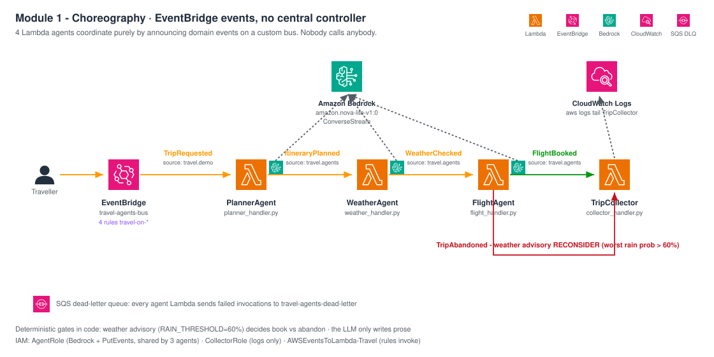
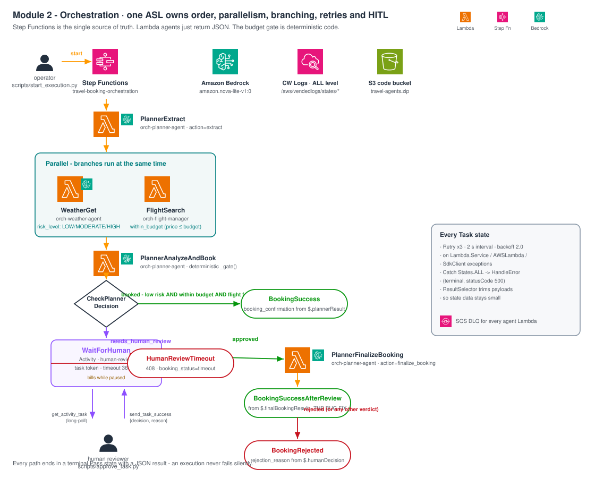
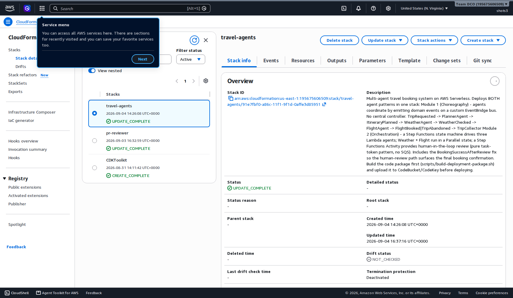
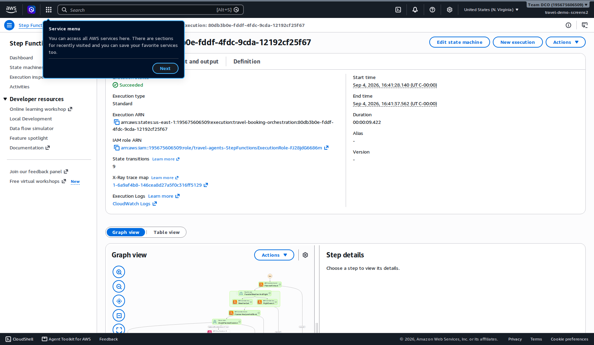
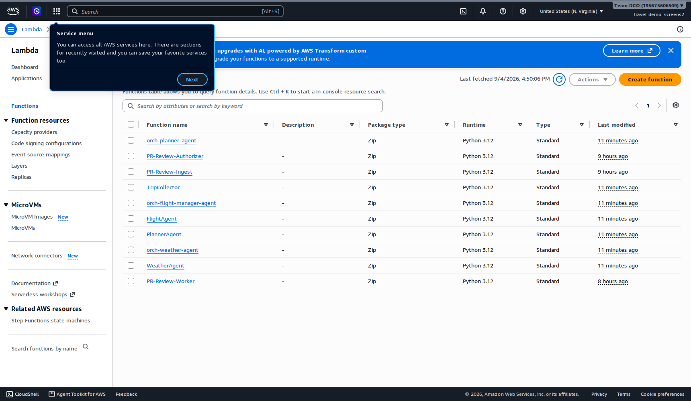
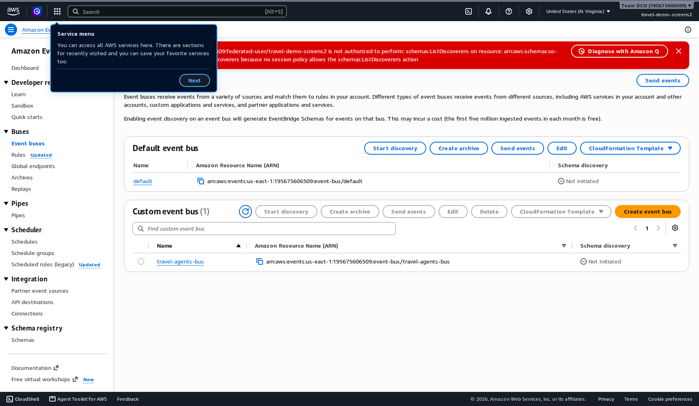

# Agentic AI Architectures with AWS Serverless

Two multi-agent travel-booking systems - **choreography** (EventBridge events)
and **orchestration** (Step Functions + human-in-the-loop), deployed from **one
CloudFormation stack**, both calling Amazon Bedrock Nova Lite via
[Strands](https://strandsagents.com). Rebuilt from the MIT-licensed
[workshop by anuagarwaluk](https://github.com/anuagarwaluk/Agentic-AI-architectures-with-AWS-Serverless);
adds the Module 2 agents, an ASL bug fix, one combined template, helper scripts.

| | Module 1 - Choreography | Module 2 - Orchestration |
|---|---|---|
| Coordination | Domain events on a bus; nobody calls anybody | State machine is the source of truth |
| Agents | 4 Lambdas | 3 Lambdas, weather + flight in parallel |
| Branching | Hidden in a handler | Visible `Choice` state |
| Human-in-the-loop | - | Activity + task tokens |

## Architecture




## Deploy

```bash
scripts/build-deployment-package.sh                       # 1. build zip (~13 MB)
ACCOUNT_ID=$(aws sts get-caller-identity --query Account --output text)
aws s3 mb s3://travel-agents-code-${ACCOUNT_ID} --region us-east-1 2>/dev/null || true
aws s3 cp travel-agents.zip s3://travel-agents-code-${ACCOUNT_ID}/  # 2. upload
aws cloudformation deploy --region us-east-1 --stack-name travel-agents \
  --template-file templates/travel-agents.template.yml \
  --parameter-overrides CodeBucket=travel-agents-code-${ACCOUNT_ID} \
  --capabilities CAPABILITY_NAMED_IAM                      # 3. one stack
```

Needs: us-east-1, Bedrock access for `amazon.nova-lite-v1:0`, AWS CLI v2, `boto3`, `zip`.
Creates bus + 4 rules, 7 Lambdas, state machine, `human-review` activity, IAM, DLQ, log groups.

## Demo

```bash
python3 scripts/send_trip_request.py "3 days in Lisbon in May from London"   # Module 1
# watch: aws logs tail /aws/lambda/TripCollector --follow

python3 scripts/start_execution.py --input-file scripts/sample-execution-auto.json  # budget 400 -> books
python3 scripts/start_execution.py --input-file scripts/sample-execution-human.json # budget 50  -> pauses
python3 scripts/approve_task.py --decision approved                                # resumes & finalizes
```

## Deployed & verified

| | | | |
|---|---|---|---|
|  |  |  |  |

More: [state machine](docs/screenshots/04-sfn-state-machine.png) · [activity](docs/screenshots/05-sfn-activity.png) · [rules](docs/screenshots/07-eventbridge-rules.png) · [DLQ](docs/screenshots/08-sqs-dead-letter-queue.png) · [S3](docs/screenshots/09-s3-code-bucket.png) · [logs](docs/screenshots/11-cloudwatch-sfn-logs.png)

## More

[templates/](templates/README.md) · [src/](src/README.md) · [scripts/](scripts/README.md) ·
[asl/](asl/README.md) (bug-fix details) · [docs/operations.md](docs/operations.md)
(monitoring, cost, security, troubleshooting)

```bash
aws cloudformation delete-stack --region us-east-1 --stack-name travel-agents
```

MIT - [LICENSE](LICENSE)
